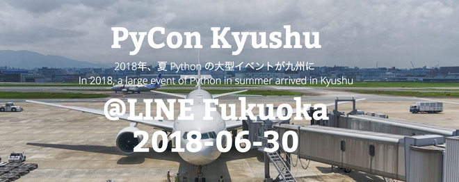

==============
PyCon Kyushuの開催趣旨
==============

PyCon Kyushu は、九州にゆかりのある Python ユーザを主体に集まったPyCon Kyushu 実行委員会を主催としてPython や Python を使ったソフトウェアについて情報交換、交流をするためのカンファレンスです。

PyCon Kyushu の開催を通じて九州の Python ユーザーの新たな開拓、および日本各地、海外との Python ユーザーと様々な分野の知識や情報を交換し、新たなパートナーやコミュニティの繁栄、仕事やビジネスチャンスを増やせる場所とすることを目的としています。

PyCon Kyushu のイベント開催を通じて、九州における Python コミュニティーを脈々と続くものとして盛り上げて行くことを目的としています。

* ホームページ: http://kyushu.pycon.jp
* 参加申し込み: https://pycon-kyushu.connpass.com/event/84062/
