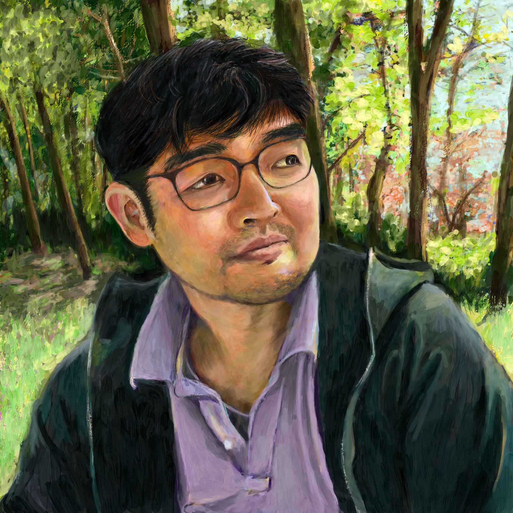
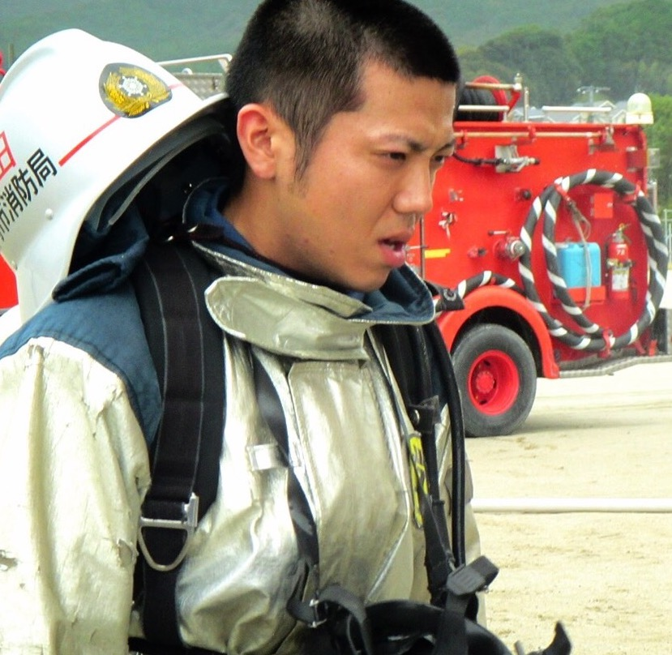
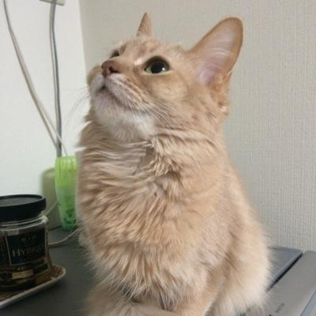

==============
執筆者
==============

| **清田 史和 (清田 史和)**
| **Fumikazu Kiyota**
| PyCon JP 2012-2016実行員で、最近は、地元の九州でのPythonの普及活動
| `SnapDish <https://snapdish.co>`_ サービス開発を手がけている
| `Vuzz Inc. <http://vuzz.com>`_ 取締役CTO
| `株式会社ナチュラルコーヒー <http://natural.coffee>`_ 代表取締役
| `学校法人北部学園ほくぶ幼稚園 <http://hokugaku.com>`_ 理事長

| **鶴田 博文 (つるた ひろふみ)**
| **Hirofumi Tsuruta**
| PyCon Kyushu 2018実行員で、`PyFukuoka <https://fukuoka-python.connpass.com/>`_ というPythonのコミュニティを運営している。
| 元消防士エンジニア。SNSでは `tsurubee <https://twitter.com/tsurubee3>`_ （つるべー）という名前で活動している。
| `GMOペパボ株式会社 <https://pepabo.com/>`_ インフラエンジニア

| **益田 祐輔 (ますだ ゆうすけ)**
| **Yusuke Masuda**
| PyCon Kyushu 2018実行員。バックエンドエンジニア。鶏の唐揚げLOVE。
| 最近は育児をしつつ、面白いサービスを生み出そうと日々奮闘中。
| WEB上では `massyuu <https://twitter.com/mass_ssn>`_ や「唐揚げエンジニャー」などと名乗っている。
