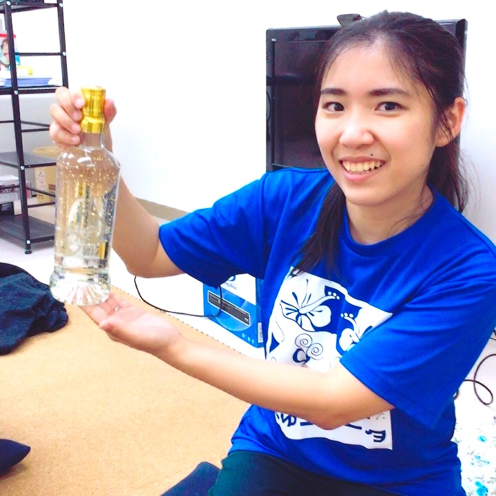

====================================
キーノート
====================================

| **真嘉比 愛 (まかび あい)**
| **Ai Makabi**

| 長岡技術科学大学にて自然言語処理を専攻。
| 卒業後は株式会社 VOYAGE GROUP に入社し、広告事業のデータ分析などを経験。
| 2016年に DATUM STUDIO 株式会社に入社し、2017年に沖縄に子会社としてちゅらデータ株式会社を創業。
| 一般社団法人 PyCon JP 理事 / PyLadies Tokyo 初代代表 / 「Python ライブラリ厳選レシピ」共著
